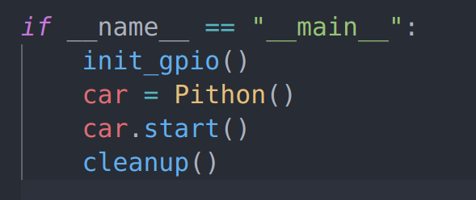
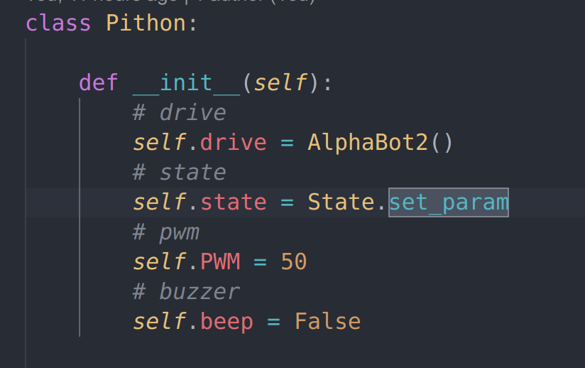
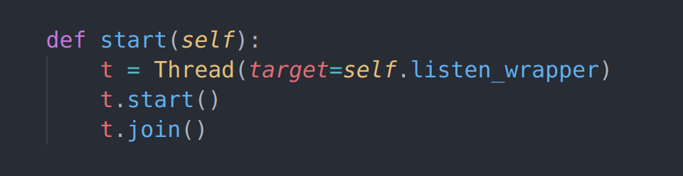
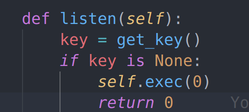
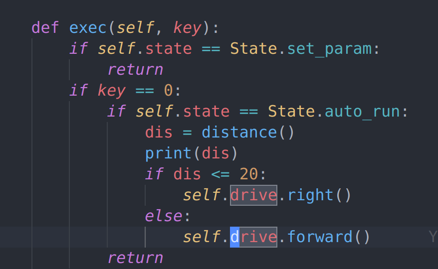
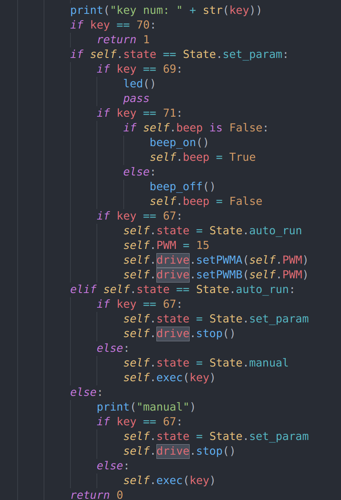
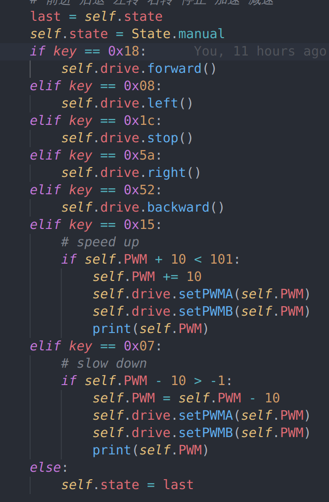
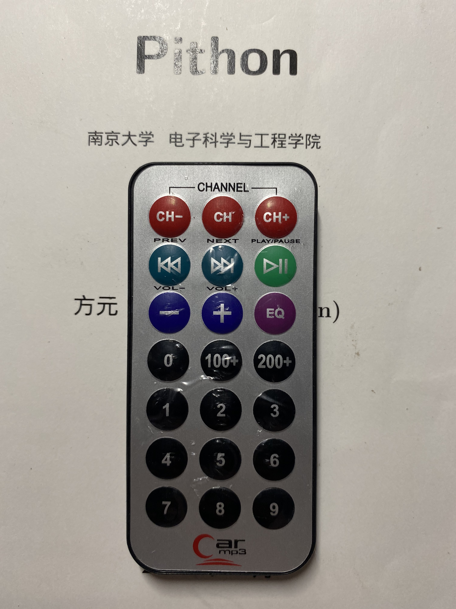
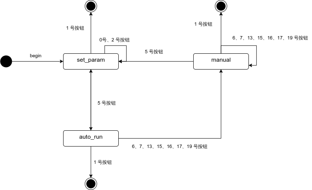

# 南大双创嵌入式应用大作业报告

课程名：智能系统中的嵌入式应用

姓名：侯为栋

院系：软件学院

学号：191250045

指导教师：方元

## 目录

- [南大双创嵌入式应用大作业报告](#南大双创嵌入式应用大作业报告)
	- [目录](#目录)
	- [1. 实验目的](#1-实验目的)
	- [2. 实验介绍](#2-实验介绍)
		- [2.1 树莓派介绍](#21-树莓派介绍)
		- [2.2 AlphaBot2 介绍](#22-alphabot2-介绍)
		- [2.3 Python 介绍](#23-python-介绍)
	- [3. 实验内容](#3-实验内容)
		- [3.1 实验方法](#31-实验方法)
		- [3.2 实验流程](#32-实验流程)
			- [3.2.1 智能小车组装](#321-智能小车组装)
			- [3.2.2 生产环境配置](#322-生产环境配置)
			- [3.2.3 Python 代码实现](#323-python-代码实现)
				- [3.2.3.1 app.py](#3231-apppy)
				- [3.2.3.2 lib/pithon.py](#3232-libpithonpy)
			- [3.2.4 树莓派测试环境配置](#324-树莓派测试环境配置)
			- [3.2.5 运行智能小车](#325-运行智能小车)
	- [4. 实验结果](#4-实验结果)
		- [4.1 控制途径](#41-控制途径)
		- [4.2 运行时模式](#42-运行时模式)
	- [5. 收获与不足](#5-收获与不足)
	- [6. 附录](#6-附录)

## 1. 实验目的

嵌入式系统（Embedded System），是一种嵌入机械或电气系统内部、具有专一功能和实时计算性能的计算机系统。

嵌入式计算机是面向应用、面向产品的、具有特定用途的计算机。它们没有刻意被制造成计算机的形态，往往以产品本身的形式展现在用户面前。

本次实验使用树莓派作为开发平台，AlphaBot 作为开发载体，Python 作为开发语言，开发一种基于红外线遥控控制的、可自动避障的嵌入式智能小车系统。

## 2. 实验介绍

### 2.1 树莓派介绍

树莓派结构简单、体积小、耗电低，却拥有与普通计算机几乎相同的功能和性能，可以很方便地植入到各种应用系统中。此类单板计算机是典型的嵌入式系统的基础。

### 2.2 AlphaBot2 介绍

AlphaBot2 智能车开发套件，包含一个基板 AlphaBot2-Base 和一个适配板（AlphaBot2-Ar、AlphaBot2-Pi、AlphaBot2-PiZero 三者之一）。其结构稳定，集成度高，不用复杂的组装以及繁琐的接线，有助于快速学习嵌入式系统开发。

### 2.3 Python 介绍

Python 有着大量支持嵌入式系统开发的第三方库，例如 RPi.GPIO 等。以 Python 作为开发语言，可以避免直接与底层交互，将主要精力放在高层抽象逻辑上。

## 3. 实验内容

源码见附录处。

### 3.1 实验方法

本次实验使用 Python 的第三方库 RPi.GPIO 和 rpi_ws281x，实现小车的红外控制、led 控制、蜂鸣器控制、超声波自动避障。

### 3.2 实验流程

#### 3.2.1 智能小车组装

本次实验用到的智能小车组件：

1. AlphaBot2-Base(基板)
2. AlphaBot2-Pi(适配板)
3. 树莓派
4. 蜂鸣器
5. 红外遥控器
6. 超声波探测器

根据 AlphaBot2 智能小车官网教程，组装智能小车。

官网链接见附录，具体路径为：资料 -> AlphaBot2 原理图/组装图 -> AlphaBot2-Pi 组装图。

#### 3.2.2 生产环境配置

本次实验的特殊性在于，生产环境无法直接测试代码，必须将代码移植到树莓派上才可以测试。

生产环境只需代码编辑器即可，以 vscode 和 PyCharm 为佳。

#### 3.2.3 Python 代码实现

系统模块如下表所示：

|模块名|文件名|依赖模块|功能|
|:---:|:---:|:---:|:---:|
|app|app.py|lib util|系统的入口文件|
|lib|pithon.py|uitl|小车状态的转换和任务调度|
|lib|alphabot.py|uitl|小车驱动控制|
|lib|led.py||小车 led 控制|
|lib|infrared.py|util|红外线解码|
|lib|buzzer.py|util|小车蜂鸣器控制|
|lib|ultrasonic.py|util|超声波测距|
|util|gpio.py||GPIO 初始化以及常量配置|
|util|state.py||小车状态枚举类|

以下是详细介绍。

注：本部分较为**冗长**且**非必需**，如有需要请结合代码查阅。

##### 3.2.3.1 app.py

系统入口为`app.py`。

`app.py`的任务是：初始化 GPIO channels，创建小车实例，开始监听，并在小车系统退出后清除 GPIO 设置。



`init_gpio()`职责是在系统启动时**唯一**初始化 GPIO channels，源码在`util/gpio.py`中。

`Pithon`为对应小车的实体类，具体实现在`util/pithon.py`中。

##### 3.2.3.2 lib/pithon.py



`self.drive`为掌控小车驱动的实体类，其实现在`lib/alphabot.py`中，提供了前进、后退、停止、左转、右转、加速、减速的驱动实现。

`self.state`为枚举类`State`的实例，具体实现在`util/state.py`中。一共三个属性`set_param`、`auto_run`、`manual`，分别对应三种状态。

`self.PWM`为小车的速度。

`self.beep`为小车蜂鸣器的开关。

该实例的启动函数为`self.start()`。职责为创建一条监听线程监听红外线信号。



`self.listen()`负责监听、处理红外信号。辅助函数为`get_key()`，实现在`util/infrared.py`中，有红外信号则返回信号，没有则返回`None`。

当没有红外信号时，小车保持当前状态。





如上图所示，如果是在`auto_run`模式下，小车会持续通过超声波获取距离，而后选择避障与否。如果实在`manual`模式下，会不作处理即保持当前运行状态。

超声波测距的实现在`util/ultrasonic.py`中。

若有红外信号，则根据当前状态进行有选择性的处理。



如上图所示，1 号按钮使函数返回 1，系统退出。

在`set_param`模式下，小车可以接收 0、1、2、5 号按钮的指令，进行相应的处理。

其中 0 号按钮控制 led，实现在`util/led.py`中，2 号按钮控制蜂鸣器，实现在`util/buzzer.py`中。

在`auto_run`模式下，只有 1、5 号按钮会改变小车状态。

在`manual`模式下，5 号按钮会改变小车状态，其余按钮在`self.exec()`函数中进行有选择性的处理。



更详细实现请自行阅读源码。

#### 3.2.4 树莓派测试环境配置

使用 ssh 连接树莓派。

```shell
ssh root@192.168.208.124
```

其中 ipv4 地址、用户名和密码视树莓派配置而定。

安装必要的依赖: [RPi.GPIO](https://github.com/yfang1644/RPi.GPIO.git) 库，以及 [rpi_ws281x](https://github.com/yfang1644/rpi_ws281x) 库。

安装方法以 RPi.GPIO 为例：

```shell
git clone https://github.com/yfang1644/RPi.GPIO.git
cd RPi.GPIO
python3 setup.py build
python3 setup.py install
cd ..
rm -rf RPi.GPIO
```

系统时间的不同步可能会导致安装失败。最佳方式是将系统时间同步后再进行 clone。

使用 scp 将生产环境代码复制至树莓派自定义位置，此处假设项目根目录为`～/code/pithon`，入口文件为`app.py`。

```shell
scp -r /path/to/your/codedir root@192.168.208.124:~/code/
```

给`app.py`设置可执行权限：

```shell
cd ~/code/pithon
chmod +x app.py
```

为达到开机自动启动的效果，需要编写自定义脚本`alphabot.sh`：

```shell
cd /home/<user-name>/code/pithon
setsid ./app.py # 创建守护进程
```

`alphabot.sh`同样需要设置可执行权限，方法同上。

将脚本移动到`/etc/init.d`文件夹中，并将脚本名放至`/etc/rc.d/rc.conf`文件中的`cfg_services`列表的倒数第二个位置。

#### 3.2.5 运行智能小车

上述步骤完成后，重启小车即可开机自动启动智能系统。

具体运行方式见实验结果部分。

## 4. 实验结果

小车能够较成功运行。

以下流程均假设小车已经完成树莓派测试环境环境配置。

### 4.1 控制途径

小车使用红外遥控器进行控制。

红外遥控器如下图所示：



自左向右，自上而下编号，将遥控器按钮编码为 0-20。

例如，第一排第三个编号为 2，第二排第三个编号为 5。

### 4.2 运行时模式

小车运行时共有三种模式：

1. set_param.
2. auto_run.
3. manual.

小车开机自动启动，进入 set_param 模式。

set_param 模式下，小车不移动。按 0 号按钮可以短暂启动 LED，按 2 号按纽可以启动蜂鸣器，按 5 号按钮进入 auto_run 模式。

auto_run 模式下，小车自动移动，并使用超声波测距来自动避障。按 5 号按钮进入 set_param 模式，按 6、7、13、15、16、17、19 号按钮进入 manual 模式。

manual 模式下，小车由遥控器手动控制。其中，6、7 号分别为加速、减速，13、15、16、17、19 号分别为前进、左转、停止、右转、后退。按 5 号按钮进入 set_param 模式。

在三种模式下，按 1 号按钮都会直接退出系统。

具体的状态图如下：



运行视频见附录。

## 5. 收获与不足

本次实验较成功完成了以 AlphaBot2 为硬件基础，Linux 为开发环境，Python 为开发语言开发运行智能小车系统的实验。

通过本次实验，我初步了解了嵌入式编程的开发流程和编程范式，了解了树莓派和 alphabot 等一系列嵌入式开发套件，为我以后选择软件学院嵌入式系统方向的课程打下基础。

但智能小车系统仍然有许多不足之处：

1. 功能不够完备，led 灯无法保持长时间闪烁，也没有实现自动寻迹功能。
2. 代码的架构不够优秀，`pithon.py`文件承担了大部分的调度功能，而这类情况本可以使用`task`类避免。同时只使用了两条线程，并发性不足。
3. 异常处理不完备。小车运行时有时会遇到超声波模块卡死的情况，此时小车无法进行其他操作，只能手动强行关机。

## 6. 附录

1. 源码仓库 [pithon](https://github.com/xxh160/pithon)。
2. [演示视频](https://www.bilibili.com/video/BV1XQ4y197sD)。
3. [AlphaBot2 官网](https://www.waveshare.net/wiki/AlphaBot2)。
